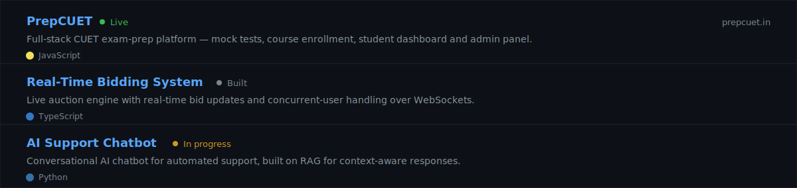
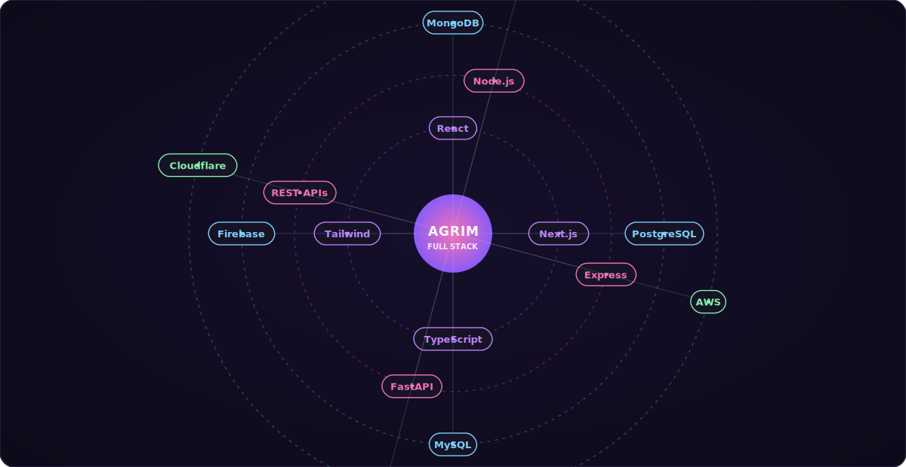

<a href="https://linkedin.com/in/agrim-khandelwal-95662527a">LinkedIn</a> ·
<a href="https://x.com/agrimcodes">X</a> ·
<a href="mailto:agrimkhandelwal5@gmail.com">Email</a> ·
<a href="https://prepcuet.in">preepcuet.in</a>

 

## About

Full stack developer based in India. I like taking a product from an empty repo to something people actually use — currently building [PrepCUET](https://preepcuet.in), a CUET exam-prep platform, and an AI-powered support chatbot on the side.

- **Building:** PrepCUET, AI support chatbot
- **Learning:** Next.js, System Design, Cloud Architecture
- **Open to:** full stack and open-source collaboration

## Projects

## Stack

## GitHub

---

Reach out at <a href="mailto:agrimkhandelwal5@gmail.com">agrimkhandelwal5@gmail.com</a>
